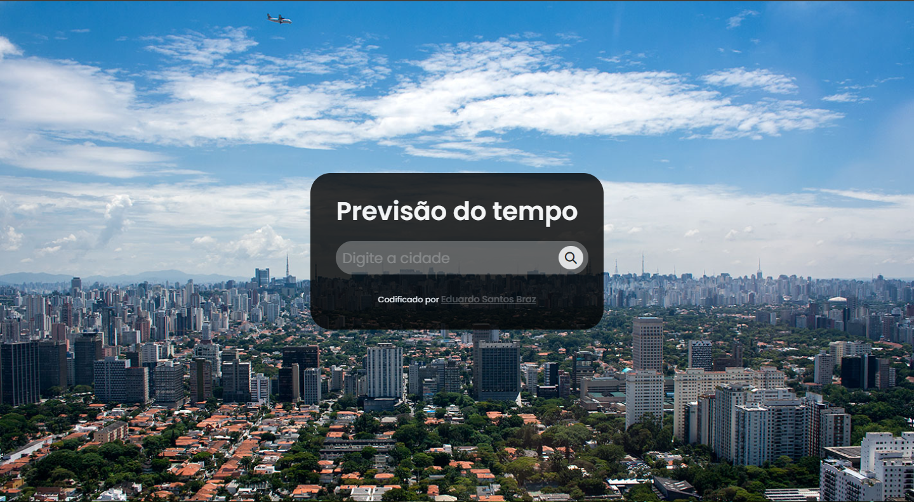

# Previsão do tempo

## Índice

- [Visao geral](#visao-Geral)
  - [Screenshot](#screenshot)
  - [Links](#links)
- [Meu processo](#meu-processo)
  - [Construido com](#Construido-com)
  - [recursos uteis](#recursos-uteis)
- [Autor](#autor)

## Visao geral

### Screenshot

### Links

- Repositorio: [Clique aqui para o Repositorio](https://github.com/EduardoBraz1/previsao-do-tempo)
- Deploy: [Clique aqui para ir ao deploy](https://classificar-atendimento.netlify.app/)

## Meu processo

### Construido com

- Marcação HTML5 semântica
- Propriedades personalizadas do CSS
- Flexbox
- SCSS/SASS
- Mobile-first
- BEM
- javascript
- Manipulação do DOM
- Consumo de API
- Tratamento de erros

### recursos uteis

- [OpenWeather API - Documentação](https://openweathermap.org/current#one) - Isso me ajudou para conseguir consumir e a usar a API da previsão do tempo de forma correta e funcional.

- [BEM - Documentação](https://getbem.com/introduction/) - Isso me ajudou a relembrar e praticar o melhor metodo para colocar classe em um elemento HTML.

- [Google Fonte - Poppins](https://fonts.google.com/specimen/Poppins) - Isso me ajudou alterar a fonte do meu projeto.

- [SASS - Documentação](https://pixabay.com/api/docs/) - Isso me ajudou a relembrar conceitos do SASS.

- [Pixabay API - Documentação](https://pixabay.com/api/docs/) - Isso me ajudou a mudar a imagem de fundo a partir da API.

## Autor

- Github - [@EduardoBraz1](https://github.com/EduardoBraz1)
- Frontend Mentor - [@EduardoBraz1](https://www.frontendmentor.io/profile/EduardoBraz1)
- Linkedin - [Eduardo Santos Braz](https://www.linkedin.com/in/eduardo-s-8b0210161/)